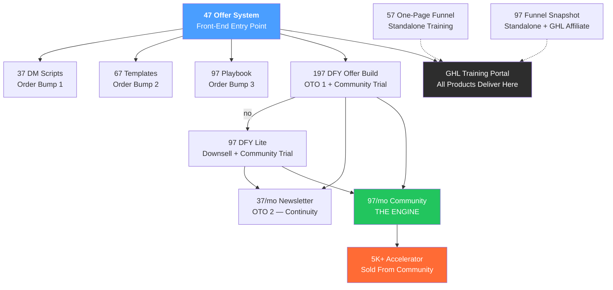

# Offer

**Validate your $5K+ offer before you build anything — in one afternoon.**

---

## The Transformation

**The arc: Confused → Clear → Converting.**

- **Confused:** Have expertise but no clear offer. Different answer every time someone asks "what do you do?"
- **Clear:** Know exactly what you sell and who it's for. One sentence. No hesitation.
- **Converting:** Offer sells itself. Clients find you, understand the offer, and buy — without a conversation.

"Client Ready" is the bridge from Clear to Converting. You become client ready when your offer is clear enough to sell without explanation.

**From:** Stuck in the search — trying offers that don't fit, grinding on content that doesn't convert, wondering if you're cut out for this

**To:** An aligned offer you won't abandon, a system that runs without constant hustle, a business built around your life

---

## The Mechanism

**The Client Ready Method:**

1. **Extract** — Find your zone of genius (the thing you do that nobody else does)
2. **Validate** — Test the offer before building infrastructure
3. **Build** — Low-ticket to high-ticket funnel with paid ads
4. **Automate** — A system that works without constant hustle

The funnel isn't the point. The alignment is the point. The funnel is how we deliver freedom.

---

## Key Philosophy

- **"You can't grow into pain"** — If it hurts to show up, you'll eventually burn it down
- **"Business around your life"** — Not a life built around your business
- **Paid traffic over content merry-go-round** — Stop posting for 12 months hoping someone buys
- **Validate before you build** — Know it works before investing in infrastructure
- **Alignment + automation** — Not scale for scale's sake
- **Self-liquidating checkout** — Front-end (~~$197~~ $47) + bumps ($37/$67/$97) + DFY upsell ($197) cover ad spend. Community + Accelerator = pure profit. Don't scale until checkout AOV is $90+.
- **Good enough to launch, then refine** -- Most decisions don't require perfect information. They require good judgment applied to good-enough data. The obsession with precision masks fear of making the call.
- **Extraction over templates** -- Client Ready pulls out what you already know and builds from that. Not "here's my system, copy it." Your zone of genius, your voice, your strengths. Translation, not inspiration.
- **Framework over feelings** -- The sprint provides structure that moves you forward even when self-doubt shows up. You don't have to trust your feelings when there's a framework doing the heavy lifting.
- **The foundation compounds** -- The discipline you're building today won't pay off this quarter. The systems you're implementing won't show results this month. But it's stacking. Quietly. Relentlessly.
- **Strategic presence over constant availability** -- Paid traffic lets you be deliberate about where you show up. Value doesn't come from being everywhere. It comes from being strategic.

---

## The Value Ladder



### Tier 1: Low-Ticket Funnel

**Front-End: ~~$197~~ $47 — Client Ready Offer System**
- PDF guide + AI prompts
- 5 AI prompts that extract zone of genius, ideal client, pain points, story, and assemble complete offer
- Step-by-step guide + offer document template
- **Promise:** Validate your $5K+ offer before you build anything — in one afternoon

**Order Bump 1: $37 — Quick Win DM Scripts**
- 10 copy-paste DM scripts (Core 5 + Quick Cash 5) for warm outreach
- Complete DM conversation system: 6-step flow, A-C-A framework, qualifying progression
- Objection handlers for price, timing, hesitation, and fit objections
- Contact tracking template
- Start sales conversations today — while you build your funnel
- **Promise:** First conversation in 5 minutes — don't wait to make money
- ~~$197~~ → $37

**Order Bump 2: $67 — Plug & Play Templates**
- Complete offer document template (with filled example)
- 3 landing page swipe files (short-form, long-form, VSL page)
- 30-day evergreen email sequence (pre-written, week by week)
- Messaging maps and client profile templates
- Awareness level messaging map (4 buyer awareness levels)
- 50+ copy-paste headlines and hooks
- 8 promo and quick cash campaign templates (flash sales, referral drives, founding member pricing, cash injection campaigns)
- **Promise:** Don't start from scratch — plug in your offer and go
- ~~$297~~ → $67

**Order Bump 3: $97 — The First $5K Client Playbook**
- Pricing psychology behind 5K+ offers (why charging more is easier than charging less)
- 3-question Pricing Confidence Framework
- 5 conversation frameworks for closing without being pushy
- The Warm 50 activation plan (5 categories, 4-week activation sequence)
- Objection playbook with 5 word-for-word scenario responses
- 3 real closing conversations, fully annotated
- **Promise:** Close your first high-ticket client — without feeling like a salesperson
- ~~$497~~ → $97

**Standalone Training: $57 — The One-Page Funnel**
- Hybrid VSL landing page structure (headline + video + long-form text + visual evidence)
- AI-assisted copy generation from your offer document
- Mobile-first design principles + GHL template
- The 5-Second Test (pre-launch gate)
- Step-by-step walkthrough: offer document → landing page copy → live page
- **Promise:** Build your landing page in one afternoon — not from scratch, from your offer
- Not an order bump — standalone portal training and second ad entry point
- **Ad angle:** Reaches "I have an offer but no page" buyers (different from the $47 "I need to figure out my offer" buyer)

**Standalone Training: $97 — The Plug & Play Funnel Snapshot**
- Pre-built GHL snapshot of the complete Client Ready funnel: landing page, checkout, order bumps, OTO pages, email sequences
- Video walkthrough: import snapshot → customize copy → connect Stripe → go live
- Includes the same funnel architecture Michael uses — not a generic template
- **Requires a GHL account** — GHL affiliate link embedded in training (40% recurring commission per referral)
- **Promise:** Your complete funnel installed in one afternoon — just swap in your offer
- Not an order bump — standalone portal training and GHL affiliate trigger
- **Ad angle:** "Stop building from scratch — import a proven funnel and customize it"

**How Snapshot differs from DFY Offer Build ($197):**

| | Funnel Snapshot ($97) | DFY Offer Build ($197) |
|---|---|---|
| Who builds it | You, with template | AI + Michael review |
| Copy | Generic — you swap in your offer | AI-generated from your inputs, Michael-reviewed |
| Strategy | Self-service video walkthrough | ICP + offer doc + ready-to-send sales doc + ad hooks |
| GHL snapshot | Standard template | No snapshot — deliverables are documents |
| Support | Video walkthrough only | 30-day community trial included |

**GHL Affiliate Layer:**
- GHL pays 40% recurring commission (~$39/mo per referral on $97/mo plan)
- Snapshot training is the strongest affiliate trigger — buyers literally can't use it without GHL
- The One-Page Funnel ($57) also includes GHL affiliate link as optional ("here's how to build this in GHL")
- Phase 2 classroom modules (funnel installation) include affiliate link
- Every GHL referral = recurring revenue on top of product revenue

---

### Training Portal Ecosystem

**All low-ticket products deliver through a GHL membership portal — not Google Docs.**

Every buyer gets portal access. Their purchased training(s) are unlocked. All other trainings appear as locked tiles with titles, descriptions, and preview images. The portal itself is a passive storefront.

**Architecture:**
```
GHL Membership Portal (Content Library)
  ├── Client Ready Offer System ($47) — unlocked on purchase
  ├── Quick Win DM Scripts ($37) — locked/unlockable
  ├── Plug & Play Templates ($67) — locked/unlockable
  ├── The First $5K Client Playbook ($97) — locked/unlockable
  ├── The One-Page Funnel ($57) — locked/unlockable
  ├── The Plug & Play Funnel Snapshot ($97) — locked/unlockable [GHL affiliate trigger]
  └── [Future trainings] — locked/unlockable

Skool Community (Support & Engagement)
  ├── Discussion, weekly calls, accountability
  └── NOT where training content lives
```

**How bumps and portal coexist:**
- Order bumps stay on checkout at $37/$67/$97 — nothing changes at point of sale
- Bumps now unlock portal tiles instead of delivering Google Doc links
- Declined bumps appear as locked tiles in portal → second-chance conversion
- Each training includes a 3-5 min video walkthrough (not just a PDF download)

**How the portal compounds revenue:**
- Every portal login is a sales impression — no email required
- Clicking a locked tile triggers one-click purchase using card on file (GHL in-app upsell)
- Second-chance bump recovery: declined bumps stay visible as locked tiles
- Every new training = new standalone ad campaign = new entry point into the same portal

**Multiple entry points (post-validation, after 30+ sales):**

| Entry Point | Ad Angle | Portal Effect |
|-------------|----------|---------------|
| $47 Offer System | "Validate your $5K offer in one afternoon" | Sees 5 other trainings locked |
| $37 DM Scripts | "First client conversation in 5 minutes" | Sees 5 other trainings locked |
| $57 One-Page Funnel | "Build your landing page in one afternoon" | Sees 5 other trainings locked |
| $97 Funnel Snapshot | "Import a proven funnel — customize in one afternoon" | Sees 5 other trainings locked + GHL affiliate |

**Metrics:**

| Metric | Target |
|--------|--------|
| Portal login rate | 60%+ of buyers |
| In-portal cross-sell rate | 10-15% of logged-in users |
| Second-chance bump conversion | 5-10% |
| CLV (30-day) | $90-120 |

See: [decisions/2026-02-18-training-portal-ecosystem.md](../../decisions/2026-02-18-training-portal-ecosystem.md)

---

### Tier 2: OTO 1 — DFY Offer Build

**Price:** $197 one-time
**Format:** AI-built deliverables + Michael review + 30-day community trial

**What's Included (6 deliverables — expanded from 4 on 2026-07-01 to match the live page):**
- **Dream Client Blueprint (ICP)** — who pays you, what they want, what's stopping them, and the exact language they use
- **Your Validated Offer** — offer extracted, structured, positioned: what you sell, who for, why it's different, why buy today
- **One-Page Sales Weapon** — ready-to-send Google sales doc for warm audiences (headline through CTA); DM/email/post it today
- **Plug-and-Play Sales Page** — full landing page (hero, problem, solution, what's included, FAQ, pricing, CTA); paste into GHL
- **Buyer-to-Client Email Machine** — 5-email sequence (welcome, story, common mistake, social proof, direct pitch)
- **5 Scroll-Stopping Ad Hooks** — five tested angles for ads, organic, or DMs, one per pain/desire
- **30-day free trial** to Client Ready Community ($97/mo after trial)
- **Promise:** Your complete offer built for you — delivered in 48 hours

> **Fulfillment note (guardrail):** 6 reviewed deliverables/order in 48h is heavy at volume. Automate generation; Michael's review = spot-check not rewrite; cap weekly slots. If margin/fulfillment gets tight, the fallback is trimming back to the original 4 (ICP, offer doc, sales doc, ad hooks) and moving the sales page + email sequence into the Community/OS. DIY-vs-DFY split protects the $67 Templates bump / $57 One-Page Funnel — keep bump copy framed as "you build it."

**How it works:**
- Buyer fills out 11-question onboarding form on thank you page
- Form triggers Claude API with Client Ready methodology baked in
- AI generates all 4 deliverables in ~30 seconds
- Michael reviews every output (~10 min) before delivery
- Delivered within 24-48 hours

**Cost per generation:** ~$0.30-0.80 (Claude Sonnet 5, six deliverables). Gross margin ~99% before ad costs.

**Downsell: DFY Lite ($97)**
- ICP + offer document only (no sales doc, no ad hooks)
- Same 30-day community trial included
- Same onboarding form, shorter output

See: `outputs/dfy-upsell/system-prompt.md` for full API spec and questionnaire

---

### Tier 2.5: OTO 2 — The Monthly Playbook (formerly "What's Working Now" Newsletter; = "OS Lite" in the OS ascension)

**Price:** $37/month (immediate charge, no trial)
**Format:** Monthly deliverable
**Position:** Shown to ALL buyers after OTO 1 (not conditional)

**What's Included:**
- Monthly breakdown of one tested offer — the ads, the page, the numbers
- Templates from that month's tests
- What worked, what didn't, what changed

**Why It Works:**
- Low-friction recurring ($37/mo feels like nothing after a $47-$197 purchase)
- Bridges to community: "Want the calls and DM access too?"
- Content is a byproduct of what Michael is already doing

---

### Tier 3: $97/month — Client Ready Community (THE ENGINE)

**Price:** $97/month, month-to-month, cancel anytime
**Format:** Membership community (Skool)
**Position:** Central engine — everything pushes INTO community, high-ticket sells FROM community

**How Members Enter:**
- 30-day free trial bundled with DFY Offer Build ($197) or DFY Lite ($97)
- Direct sign-up via email pitch or portal ($97/mo, no trial)
- Accelerator graduates stay as alumni

**What's Included:**
- Weekly hot seat calls with Michael (live coaching)
- Sprint curriculum as self-paced learning path (Extract → Validate → Build → Launch)
- DFY templates of the month (tested assets Michael is actually running)
- "What's Working Now" breakdowns
- DM access to Michael
- Peer accountability + wins

**What Moved Into Community:**
- Sprint ($297) weekly calls → community calls
- Sprint 4-week curriculum → community learning path (always available)
- Blueprint community access → all community members

**Positioning:**
> "Month-to-month. Cancel anytime. You stay because the calls and templates are worth it — not because you're locked in. No annual. No commitment you can't walk away from."

**Community → Accelerator Pipeline:**
- Members watch Michael coach for 30-90 days
- They see other members get results
- They ask "how do I work with you 1:1?"
- Michael announces limited spots → community members take them in minutes
- No sales page needed. Invoice sent. Paid. Done.

**Promise:** The room where coaches build together — weekly calls, tested templates, direct access to Michael

---

### Tier 4: $5K — Client Ready Accelerator

**Price:** $5,000 one-time
**Format:** Done-with-you intensive
**Delivery:** Asynchronous + 3 strategy calls
**Timeline:** 8 weeks

**The 4 Principles (Why No Sales Call Required):**

1. **Clear Outcome + Timeframe:** Validated, profitable funnel generating customers in 8 weeks
2. **Clear Process:** Week-by-week build with you — extraction, validation, funnel, traffic, optimization
3. **Clear Delivery:** 3 strategy calls, unlimited Loom reviews, direct Slack access, all assets built together
4. **Easy to Start:** Pay, onboard form, first call scheduled within 48 hours

**What's Included:**
- Complete funnel architecture (offer → traffic → conversion → ascension)
- Zone of genius extraction and offer refinement
- Landing page copy and design direction
- Email sequences (welcome, ascension, retargeting)
- Ad creative direction + first campaign setup
- 3x 60-minute strategy calls (kickoff, midpoint, launch)
- Unlimited async support via WhatsApp/Loom for 8 weeks
- Post-launch optimization session (Week 8)

**Who This Is For:**
- Community members who've been watching Michael coach for 30-90 days
- Already validated their offer (bought the $47 or DFY)
- Want speed + expert guidance, not DIY
- Ready to invest in getting it right the first time

**Guarantee:** Profitable funnel or we keep working until it is

**How They Buy (Community-First):**
- Michael announces limited spots in community ("5 spots open this month")
- Community members who've watched him coach already trust the quality
- They respond — invoice sent directly
- No sales page needed, no call needed — onboarding within 48 hours
- Fallback: No-phone offer page still exists for email-driven buyers not in community

**Why No Sales Call:**
> "If you need a sales call to decide, this isn't for you yet. You've been in the community. You've seen the work. This is for people who already know — they just need to start."

---

## Funnel Metrics

| Step | Price | Type |
|------|-------|------|
| Front-end | $47 | One-time |
| Bump 1 (DM Scripts) | $37 | One-time |
| Bump 2 (Templates) | $67 | One-time |
| Bump 3 (First $5K Client Playbook) | $97 | One-time |
| Standalone (The One-Page Funnel) | $57 | One-time (portal training, not a bump) |
| Standalone (Plug & Play Funnel Snapshot) | $97 | One-time (portal training + GHL affiliate trigger) |
| OTO 1 (DFY Offer Build) | $197 | One-time + 30-day community trial |
| Downsell (DFY Lite) | $97 | One-time + 30-day community trial |
| OTO 2 (Newsletter) | $37/mo | Recurring (immediate charge) |
| Community | $97/mo | Recurring (month-to-month after trial) |
| Backend (Accelerator) | $5,000 | Sold from community |

**Max One-Time Cart Value:** $545 ($47 + $37 + $67 + $97 + $197 + first $37 newsletter)
**Checkout AOV target:** $90-110 (front-end + bumps — self-liquidating)
**Full funnel AOV:** ~$135 (including OTOs)
**90-day value per buyer:** ~$260 (including recurring + Accelerator attribution)
**Recurring streams:** Community ($97/mo) + Newsletter ($37/mo) + GHL affiliate (~$39/mo)
**Portal cross-sell potential:** One-Page Funnel ($57) + Funnel Snapshot ($97) + second-chance bumps add to 30-day CLV
**GHL affiliate potential:** ~$39/mo recurring per Funnel Snapshot buyer who signs up for GHL
**DFY cost per generation:** ~$0.30-0.80 (Claude Sonnet 5, six deliverables) — near-zero marginal cost

---

## Email Ascension System

**The engine that turns $47 buyers into $5K clients — without phone calls.**

### Daily Email Rhythm

Every day, one email goes to your customer list. Not prospects. Buyers.

**The Framework:**
1. **Story** — Personal experience, client story, lesson learned
2. **Offer** — One product from your ladder (rotate through)
3. **CTA** — Clear, single action

**Why Daily:**
- Buyers forget you within 72 hours if you don't email
- Daily = top of mind when they're ready to ascend
- Story-first builds relationship; you're not "that person who only pitches"

**Every email is an offer — reply-based, no phone (Miles, Jun 2026):**
- Each daily email ends with a single CTA: **"reply back to get your offer document"** (or to start the conversation). Story → tie to the offer → soft reply CTA.
- Not always urgency. Example: a story about staying calm playing tennis → tie to staying calm spending on ads → "if you want to run ads profitably, reply back."
- **Benchmark: ~2.4% reply rate** across 30 days of daily emails. Low/zero replies = the email messaging isn't there yet (normal early — keep iterating the message and the offer, not the cadence).
- This reply-to-this-email path is the no-phone backend mechanism — it opens the conversation that leads to the high-ticket sale without a call.

### The 10-Day Welcome Sequence

New buyers get a 10-email sequence over 10 days. **This sequence is relationship-first with soft ascension in the iron strike window (Days 5-9).** Parallel recovery sequences handle direct upsell pitches separately.

| Day | Subject | Focus |
|-----|---------|-------|
| 1 | You're in — here's your first win | Quick win + access |
| 2 | Why I do this (honest answer) | Origin story |
| 3a | Now that you've started... | Advanced tips (if opened product) |
| 3b | Haven't started yet? | Quick start (if NOT opened product) |
| 4 | The mistake that cost me 6 months | Common mistake |
| 5 | The 2-minute test for your offer | Quick tip |
| 6 | From stuck to first client in 30 days | Transformation story |
| 7 | What my morning actually looks like | Behind the scenes |
| 8 | "What if I'm not ready?" | FAQ / objection |
| 9 | What happens after $47 | The roadmap |
| 10 | Come hang out | Community invite |

**Ascension touchpoints (iron strike window):**
- **Day 3:** Consumption branch — splits based on product access (see below)
- **Day 5:** Soft close after quick tip — "If you've done the test and you're ready for the next step, let us build your offer for you. $197 — delivered in 48 hours."
- **Day 7:** Soft close after behind the scenes — "This is what it looks like when the system runs. Want to skip the DIY? Here's how."
- **Day 9:** Explicit CTA in roadmap email — "You're here. The next step is the community — weekly calls, tested templates, direct access. Here's how to join."

**Iron Strike Principle:** Research across 6+ practitioners shows ascension probability peaks in the first 7-21 days after purchase. After 3 weeks, it drops significantly. Days 5/7/9 carry soft ascension CTAs within the relationship email — not separate pitches. Same voice, same tone. If it reads like a pitch, rewrite it. See [decisions/2026-02-14-ecosystem-architecture-iron-strike.md](../../decisions/2026-02-14-ecosystem-architecture-iron-strike.md).

**Day 3 Consumption Branch:**
GHL tracks whether buyers access the product by Day 3. Two paths:
- **Opened product →** "Advanced Tips" email: "Now that you've started, here's how to get the most out of Prompt 3..."
- **Hasn't opened →** "Quick Start" email: "Hey, noticed you haven't jumped in yet. Here's the single fastest win — takes 5 minutes..."
Why: Buyers who consume are exponentially more likely to ascend. Non-consumers need accountability, not more pitching.

**Parallel Recovery Sequences (Days 2-8, sent at 2PM alongside 8AM welcome emails):**
- **Bump Recovery** (3 emails, Days 2/4/6) — pitches only the bumps they missed
- **DFY Recovery** (2 emails, Days 3/5) — DFY Offer Build for buyers who declined at checkout
- **Community Recovery** (1 email, Day 8) — direct community sign-up for buyers not on trial

After Day 10, they join the daily broadcast (Day 11+).

### Accountability Outreach (DFY Buyers)

Manual DM within 48 hours of DFY purchase:
> "Hey [name] — saw you grabbed the DFY Offer Build. Just wanted to make sure you filled out the onboarding form. Once you do, we'll have your deliverables back in 24-48 hours. What are you working on right now?"

Not a sales call. Accountability and support. Opens a conversation that naturally deepens engagement and drives community trial activation. At current volume: 1-3 DMs per week. When volume exceeds ~20/week, hire a setter.

**Trigger:** GHL notification on DFY Offer Build or DFY Lite purchase → manual DM within 48 hours.

**Implementation:** 6 GHL workflows with separated concerns + consumption tracking branch + DM notification trigger. See [outputs/emails/ghl-workflow-setup.md](../../outputs/emails/ghl-workflow-setup.md) for full setup.

### Why This Works

From Miles Stutz research:
> "Your customer list is your ATM. You write an email, you make money. But only if you show up daily."

Most coaches email weekly (or never). Daily = compound advantage.

See: [reference/domain/funnel/email-rhythm.md](../domain/funnel/email-rhythm.md) for full implementation details.

---

## Guarantees

**30-Day Money Back (All Products):**
> "If you don't get results using our templates and support, send us an email at any time and we'll refund every penny of your investment — no questions asked."

**DFY Delivery Guarantee (OTO 1 - $197 DFY Offer Build):**
> "Your ICP, offer document, ready-to-send sales doc, and ad hooks — delivered in 48 hours. If we miss that, you get a free month of community on top of your trial."

**Community Guarantee:**
> "Month-to-month. Cancel anytime. If the first call doesn't blow your mind, cancel before your trial ends and you pay nothing."

---

## Objection Handling

| Objection | Response |
|-----------|----------|
| "I don't have an offer yet" | That's exactly what the $47 system solves — extract and validate in one afternoon |
| "I'm not tech savvy" | The templates are plug-and-play — fill in blanks, copy-paste, done |
| "I don't have an audience" | Start with your warm audience first. The traffic playbook shows you how to find buyers without ads. |
| "What if it doesn't work?" | Every product has a money-back guarantee. The community adds personal accountability — weekly calls with Michael plus peer support to keep you moving. |
| "I don't want another subscription" | The community is month-to-month. Cancel anytime. No annual. No lock-in. You stay because the calls and templates are worth it — not because you're trapped. |

---

## Checkout Optimization

**Proof on checkout page:** Low conversion often = missing proof (Miles Stutz feedback). Add 2-3 short testimonial snippets above order bumps.

**Checkout proof elements:**
- Short testimonial quotes (1-2 sentences max)
- Specific results when available ("landed 3 clients in first week")
- Photos if available (increases trust)

**Pre-checked bumps:** Test both approaches:
- Pre-checked: Higher take rate with sophisticated buyers
- Unchecked: May convert better with less aware audiences
- Run 50/50 split test before scaling

**Bump pricing insight (Cat Howell Feb 2026):** Higher-priced bumps convert better. Her split test: $33/$44/$55 bumps at 4.0% conversion vs $17/$33/$55 at 2.3%. Early data but directionally strong. Test increasing bump prices once baseline data exists.

**Front-end pricing warning:** $17 front-end killed Cat's AOV (dropped from $140 to $70-80). Cheap buyers don't buy bumps/upsells at the same rate. $27 is minimum; $47 is her sweet spot. Client Ready moved from $27 to $47 based on this data. At $47, front-end + bumps target self-liquidating AOV of $90-110. **External validation (Feb 2026):** Miles Stutz killed his $7 front-end (digitalsnacks.co) entirely and moved to $17 (rapidascension.freeclientsystem.com). Cheap front-ends attract cheap buyers who don't ascend. $47 remains the right price point for buyer quality.

**Scaling via entry points (future):** Existing bumps (DM Scripts, $5K Playbook) can become standalone front-end offers once core funnel is validated (30+ sales, $100+ AOV). See [decisions/2026-02-12-scaling-architecture.md](../../decisions/2026-02-12-scaling-architecture.md).

### Order Bump & OTO Design (Miles, May 2026)

**The core rule:** a bump/OTO must **never feel required** to get results from the front-end purchase. The moment a buyer senses "this won't work unless I also buy the bump," it tanks both front-end conversion AND bump uptake. A bump/OTO may only do one of two things:

1. **Add convenience** — automation, speed, done-for-you, integration. (You *can* do it yourself; this makes it faster.)
2. **Solve the next problem** that naturally arises once the front end solves the first. ("Problem → solution → next problem → solution.")

**Generate them with AI:** "Here's what I sell; give me order bumps/OTOs that either add convenience or solve the immediate next problem." (Maria Wendt example Miles praised: core = make more per customer → OTO1 tool that picks your bumps for you [convenience] → OTO2 diagnostic that finds where you lose money [next problem] → OTO3 AI product-builder [convenience].)

**Client Ready already maps to next-problem** — $37 DM Scripts (now start conversations) → $67 Templates (don't build from scratch) → $97 Playbook (now close). Structure is right; sharpen the *headlines*.

**Direct-response bump headlines with the guarantee baked in:** every low-ticket has a money-back guarantee anyway — put it in the bump headline. Pattern: "Integrate this and [specific result in N days] — or your money back." Signal: "mine is better than yours."

**Sell the outcome, not the category.** Audits/calculators/tools convert poorly on the front end — the problem-aware market already knows. Sell the tangible result they're *already* looking for ("instantly know X in 5 min/day"), not a solution they aren't searching for ("audit your business"). You know they need it because you're the consultant; they don't.

**Order-bump price is testable both ways:** a $12 bump that won't sell can sell at $24 (price signals value). But if they won't take it at $27, they won't at $47. If you get 20–30 sales and ~1 bump, the offer isn't good enough — replace it, don't just re-price.

**Launch before the product exists (for NEW snacks):** spend day one on the sales page only, go live, and build/deliver within 24h of the first sale (automation: "automation hiccup — delivered within 24h"). Validate demand before building. Bumps only; defer OTOs until after the first sale.

### Sales Page: Short-Form First, Then Add Sections (Miles, May 2026)

Every funnel starts **short-form**. Insight: "the less you say, the more *curiosity* purchases you get — and curiosity buyers take fewer bumps." So **low bump uptake is often a thin-sales-page problem, not a bump problem.**

- Once short-form converts, **add ONE section at a time and A/B each:** who it's for (niches/regions), what's inside, "what this does to your life" (emotional), who you are, proof + guarantee.
- **Kill a section if no significance after ~200 views.**
- Adding good context *without* dropping front-end conversion → bumps/OTOs rise naturally (buyers understand what they bought).

**Checkout (step 2) benchmark = 30%.** On the two-step order form, step 2 should convert ~30%. Below 20% → reposition proof on the checkout page and strip friction fields (phone, coupon codes — anything not strictly required). Bumps themselves can drag checkout conversion down.

**Testing cadence by volume:** at low volume you can change several things at once (hunting 50%+ swings). The one-thing-at-a-time discipline only matters once you're at ~500–1,000 sessions/day.

---

## Ad Strategy Framework

**From Miles Stutz + Cat Howell + Andromeda/2026 deep research (Feb 2026).**

### Post-Andromeda Principles

These override all tactical advice below. If a tactic conflicts with these principles, the principle wins.

1. **Creative IS targeting.** Post-Andromeda, Meta's algorithm operates at the account level. Your ad copy and visuals are the primary audience signal. Broad targeting is the default.
2. **Radical Creative Variance.** Testing minor variations (button colors, slight copy tweaks) is dead. Test entirely different concepts — Silent Review vs Founder Story vs Problem/Solution — to reach different pockets of the broad audience.
3. **What's NOT working in 2026:** Interest stacking (restricts AI, raises CPMs), micro-budget ad sets ($5/day never exits learning phase), naked VSL pages (video-only pages bounce hard), manual placements ("Feed Only" is a mistake — Advantage+ Placements finds cheaper inventory), lookalikes as primary targeting (algorithm does it better automatically).

### Launch Strategy: Front-End First

**Phase 1 (Launch):** Short-form sales page + 3 order bumps + thank you page. Full *checkout* from day one. (See "Launch cadence" below — OTOs are added *after* the front end validates, not before.)

### Launch Cadence: 3 Snacks → Double Down (Miles, Jun 2026)

The operating unit is not "the funnel" — it's **3 different low-ticket funnels launched at once.**

1. Launch **3 distinct digital snacks** (different offers/angles), each a short-form page + order bumps.
2. Spend **$10/day per ad set** (Big Six + worldwide), ~$100–300 total per snack, finishing the full test.
3. **Pause the losers, double down on whichever produces sales.** Often 2 of 3 will sell — run both winners.
4. Speed to launch is everything — get the next snack live as fast as humanly possible (let AI write copy + make images).

### Post-Validation Optimization Order (Miles, Jun 2026)

Once a snack has produced sales, optimize in this exact order — **don't skip ahead:**

1. **Order bumps → 33%+.** Fix the bump copy or replace the bump entirely. (Currently target; 25% is "fine, keep them," 33%+ is the goal.)
2. **Build 1–2 OTOs** — but ONLY now, after the front end is validated. Don't build OTOs for an unproven funnel (wasted effort). *Order bumps ship with the funnel; OTOs are a post-validation step.*
3. **A/B test the front-end headline.** Screenshot the funnel → AI suggests a B variant → split test.
4. **Then** scale budget.

**Hard rules:**
- **Do not relaunch/scale ads before the OTOs are connected** — "you won't break even or go profitable without them."
- **Do not scale budget until the OTO converts at 5–10%.**
- A **$113 CPA is acceptable** *if* bumps + OTOs lift AOV enough to absorb it. The whole point of bumps+OTOs is to raise AOV so you can afford a higher CPA than a naked front end could.

**Two-step order form is mandatory.** Never run a funnel without the opt-in step — it enables abandoned-cart sequences and grows the list. 60–70% add to cart and never check out; without the opt-in you can't recover them. (A "show everything like an open sales page" form removes both abilities.)

**Meta budget-consolidation (2026 reality):** Meta will kill the other ads in a set and dump budget into one (based on initial likes/comments/dwell). If that ad's CPA is too high, turn off *that one ad* first (not the whole set) and see if the set recovers — it often dies anyway. Expect to **launch new ad sets ~weekly** at low/mid budget; ads stabilize only at higher spend ($500–700/day with proven winners).

### Pre-Launch Requirements

- **CAPI (Conversions API):** Server-side tracking that bypasses browser cookie blocking (iOS 14+). Improves "Event Match Quality" score, lowers CPMs. Set up before first dollar of ad spend.
- **Landing page split test:** Run two variants from launch — Variant A: Hybrid VSL (headline + video + long-form text + visual evidence) vs Variant B: Static mockup (headline + product screenshots + long-form text + visual evidence). Same copy, same offer, same checkout. 50/50 split, $50/day minimum per variant. Judge after 30 sales per variant. If within 20% after 50 sales each, keep video (brand compounds). See [decisions/2026-02-22-miles-stutz-mining-response.md](../../decisions/2026-02-22-miles-stutz-mining-response.md) Decision 7.
- **5-Second Test** passed on all pages (see below)

### Three-Stage Campaign Pipeline

Not interchangeable. Each stage has a different job.

**Stage 1: ABO Testing (Permanent Sandbox)**
- Campaign type: ABO, Sales objective
- One CONCEPT per ad set (Pain, Mechanism, Social Proof) — variants within
- $50/day per ad set, 3 ad sets minimum
- Launch 3 new ad sets per week
- Creative mix per ad set: 2-3 B-roll videos with overlay text + 2-3 static images, each with short-form and long-form copy
- **5 images per copy block minimum:** Same body copy across 5 different image creatives. Let Meta find which visual works for each audience segment. Image types to test: product mockup, lifestyle, text-on-background, bold color interrupt, device screen. (Miles Stutz Feb 2026: runs 54 images on same copy block.)
- **Budget-dependent copy-to-image ratio (Miles, Jun 2026):** At **$10/day per ad set**, run **5 images each with a *different* copy (1:1)** — Facebook flags duplicate ads if you reuse the same copy across images, and $10 is too little to test image and copy separately. Only at **$30–50/day** do you give Meta more to chew on: 5 images × 2 copies each (1 long-form, 1 short-form). The "same copy across 5 images" block is a higher-spend tactic.
- **Headline match — ad ↔ sales page (Miles, Jun 2026):** "Ads fail because the ad says buy pizza and the page says buy pasta." Always include 1–3 text-heavy ads that put the *exact* sales-page pre-headline + headline into the ad (screenshot the page if needed). Direct match = higher conversion. Surround those with AI-generated image variants.
- Run 72 hours untouched before judging
- **$20 rule for low-ticket:** Winners reveal themselves after ~$20 of spend per concept. Faster signal than higher-ticket offers.
- This campaign NEVER turns off. It's your permanent testing sandbox.

**Stage 2: CBO Winners**
- Graduate winners from ABO via **Post ID extraction** (retains social proof — likes, comments, shares)
- Broad CBO, one ad set, 5-6 winning ads inside
- $100/day starting budget
- Scale 20% every 2-3 days as long as CPA holds
- **Cost Caps for scaling:** At higher spend, use Cost Caps (target CPA bidding) instead of Lowest Cost. Set cap slightly above target CPA — Meta only spends when it finds conversions at that price. Protects profitability on volatile days.
- Need 10+ sales per creative before graduating to CBO (statistical significance)

**Stage 3: Scale — CBO is the workhorse; ASC is optional/account-dependent**
- **CBO (Campaign Budget Optimization) is Miles's actual scaling vehicle** (May 2026). He runs both his offers on one CBO campaign and just keeps adding new ad sets + ads into it. This is the default to reach for.
- **ASC (Advantage+ Shopping) is account-dependent — Miles skips it.** "Advantage sales campaigns just don't work well for me." It works for some accounts (e.g. Hernán) but is not the assumed final stage. Test it only if CBO plateaus; don't treat it as the required endpoint.
- ASC tradeoffs when you do test it: can lower CPA 17-30% but no targeting control (black box), struggles to exclude past purchasers, over-indexes on retargeting at low volume.
- **Bid caps at scale:** "Let Meta spend $120 max to win a bid" → makes sales volume and cost-per-sale consistent. Use once you're spending substantially.
- **Scaling a winning ad:** don't turn off the other ads in its set — scale the set. Copy the winning **Post ID into multiple ad sets** to put more spend behind the one proven ad (keeps accumulating social proof). Ad "refreshes" rarely work; instead have AI study the winning *angle* and build new ads around it.

### 70/20/10 Budget Split

| Allocation | Budget | Campaign |
|-----------|--------|----------|
| Scaling | 70% | Broad CBO, best creatives |
| Testing | 20% | ABO sandbox, new concepts |
| Retargeting | 10% | Optional, or fold into scaling |

**Launch phase flip:** At launch, reverse to 70% testing / 30% scaling (no winners yet). Shift ratio as winners emerge.

For $150/day launch: $105 scaling / $30 testing / $15 retargeting. But flip at launch: $105 testing / $45 scaling.

### Targeting

- Broad is default (creative IS targeting)
- **Never US-only.** US has the highest CPC. Mixing countries lets Meta distribute for cheaper acquisition (Miles, Jun 2026).
- **"Big Six" bundle:** US, UK, Australia, New Zealand, Ireland (+Canada optional). Tier-1 English-speaking. This is the default geo for a new funnel.
- **Always also run one worldwide ad set** — often the cheapest CPA and biggest scale. Caveats: monitor the comment section (worldwide attracts junk/weird commenters), and for some ad accounts worldwide just doesn't work → tame down to Big Six.
- Don't restrict with interests/professions/age/gender when launching a new funnel — keep it open, let Andromeda find the buyer. Narrow only *after* the data tells you to (e.g. 90% of junk clicks from one region → exclude it; or follow intuition to test women-only as a deliberate A/B).
- **~$2 per qualified click** is the benchmark. If you see thousands of clicks at sub-$0.10 each with no sales, that's junk geo traffic — fix targeting, not the sales page.
- No separate retargeting in acquisition campaigns — the algorithm handles it within broad (allocates 20-30% of spend automatically)

### Creative Format Rankings (2026)

1. **"Ugly" static text-on-background** — Notes app screenshots, tweet formats, high-contrast text on plain backgrounds. Driving 60-70% of conversions for many accounts. They read as content, not ads.
2. **Silent Review** — Screen recording of the product (PDF, prompts, templates) without speaking. Facial reactions + text overlay only. Feels native, breaks the pattern of "shouting" marketers. TikTok-native, high trust.
3. **B-roll with text overlay** — Still strong, already in the framework.
4. **Founder face-to-camera** — Essential for brand building, not the best performer for cold traffic.
5. **AI UGC** — Good for volume testing ($100 vs $1000 per asset) but buyers spot deepfakes.
6. **Human UGC** — Highest trust for hero assets.

**Client Ready applications:**
- **Silent Review:** Screen recording of the 5 AI prompts in action, or scrolling through the offer document template with reaction shots and text overlay.
- **Ugly static:** One-liners batch screenshotted as Notes app entries or tweet formats.
- **"Don't Buy This" hook:** "Don't buy this system... if you hate having an offer that sells itself." Reverse psychology — filters for high-intent buyers, increases curiosity.

### CPA Decision Thresholds

For your funnel (AOV $100-120):

| CPA | Action |
|-----|--------|
| > $150-200 | Kill the ad |
| $80-120 | Let it run, monitor |
| < $80 | Scale 20% every 48 hours (both testing and scale campaigns) |

### The $300 Rule

> "If you spend $300 without a sale, change the snack. Don't optimize — change the offer."

**Sales cluster on the first or last day (Miles, Jun 2026):** "It either happens on the first day or on the last day." Three sales can land in the final $30 of a $300 test. This is *why* you finish the full test — killing at $270 throws away winners. Don't change anything mid-test until you've spent the full budget (or shown the ads manager on a coaching call).

**$20 rule (low-ticket shortcut):** For a $47 product, winners reveal themselves after ~$20 of spend per concept. If a concept hasn't shown signal by $20, it's probably not going to. (Note: this is a faster screening heuristic; the $300/first-or-last-day rule governs the full validation test.)

**Testing priority when stuck:**
1. Offer (biggest impact)
2. Headline
3. Price
4. Design

### Landing Page Structure: Hybrid VSL

Naked VSLs (video-only pages) are dying — high bounce rates from cold traffic. The winning format is the Hybrid VSL:

1. **Headline** — Big promise, visible instantly
2. **VSL video** — 5-15 min, founder + B-roll of product
3. **Long-form text** — Entire script adapted to readable copy BELOW the video
4. **Visual evidence** — GIFs/screenshots of the actual product being used (the PDF, the AI prompts, the offer document template)
5. **Mobile-first** — 80%+ of traffic is mobile

**Why it works:** Buyers who won't watch a video can still read the pitch. Visual evidence proves the product is REAL. Your case study and personal story are defensible assets that AI-generated ads can't replicate.

### Target Metrics

**Checkout Metrics:**

| Metric | Target | Calculation |
|--------|--------|-------------|
| Checkout CVR | 30% | Completed purchases / checkout page views |
| AOV | $100-120 | Total revenue / orders |
| Combined bump rate | 50%+ | Orders with ANY bump / total orders (Cat Howell benchmark) |
| Bump 1 ($37) | Track | Bump 1 purchases / orders |
| Bump 2 ($67) | Track | Bump 2 purchases / orders |
| Bump 3 ($97) | Track | Bump 3 purchases / orders |

**Note:** Cat's 50% benchmark = half of all buyers take at least one bump. Individual bump rates will be lower. Don't scale ads until AOV is consistently $100+.

**OTO Conversion Benchmarks (Cat Howell Feb 2026):**

| OTO | Price | Expected Conversion |
|-----|-------|---------------------|
| OTO 1 DFY Offer Build | $197 | 15% |
| Downsell DFY Lite | $97 | 10% of remaining |
| OTO 2 Newsletter | $37/mo | 8% |
| Community | $97/mo | Via trial or direct sign-up |

**Traffic Metrics:**

| Metric | Target | Calculation |
|--------|--------|-------------|
| CPA | < $100 | Ad spend / purchases |
| Opt-in rate | 3%+ | Opt-ins / outbound clicks |
| Sales page conversion | 10%+ | Purchases / opt-ins |

**Track in Stripe/GHL, not Meta.** Meta over-attributes.

### Mid-Funnel Branding Campaigns

**The single highest-ROI mid-funnel activity** (Miles Stutz, Feb 2026).

**What it is:** Meta engagement campaigns optimized for through-play video views. Not selling — just you being useful. Retargets your buyer audience so they see your face constantly.

**Setup:**
- Campaign type: Engagement (video views, through-play)
- 5-10 head-talking videos, 90 seconds to 3 minutes
- Source: existing Instagram posts (no new content needed)
- Take the post ID from Instagram
- Budget: $5/day per ad to start
- Target: retarget all buyer/visitor audiences first, then expand to cold

**When to launch:** After 50-100 front-end sales (need audience to retarget). Start with 5 videos at $5/day each ($25/day total). Scale as audience grows.

**Why it works:** Creates frequency and familiarity at scale. Buyers see your face 6+ times. When they're ready to join the community or ascend to Accelerator, you're the obvious choice. Replaces "post and pray" organic strategy. Works alongside email — double exposure on two channels.

**Miles' results at scale:** 40,000-person retargeting audience, $250/day, frequency of 6, selling profitably from retargeting alone. Gets DM sales from people he's never spoken to.

### 5-Second Test (Pre-Launch Gate)

Before spending money on any page, it must pass this test. Look at the page for 5 seconds and answer:

1. **Who is this for?** — Target audience visible instantly
2. **Why am I here?** — The payoff/result they'll get
3. **Why should I care?** — Unique differentiator (mechanism + without statements)
4. **Why should I believe?** — Trust signals, testimonials, proof
5. **What do I do next?** — Clear CTA

If you can't answer all five instantly, the page isn't ready for traffic.

---

## See Also

- [soul.md](./soul.md) — The beliefs behind the offer ("you can't grow into pain")
- [audience.md](./audience.md) — Who buys and the buyer journey
- [voice.md](./voice.md) — How the offer is communicated
- [content-strategy.md](../domain/content-strategy.md) — The distribution engine (newsletter-first)
- [testimonials.md](../proof/testimonials.md) — Proof and client wins
- [launch-strategy.md](../../outputs/ads/launch-strategy.md) — Ad scaling roadmap for the front-end
- [main-angles.md](../proof/angles/main-angles.md) — Messaging angles for ad campaigns
