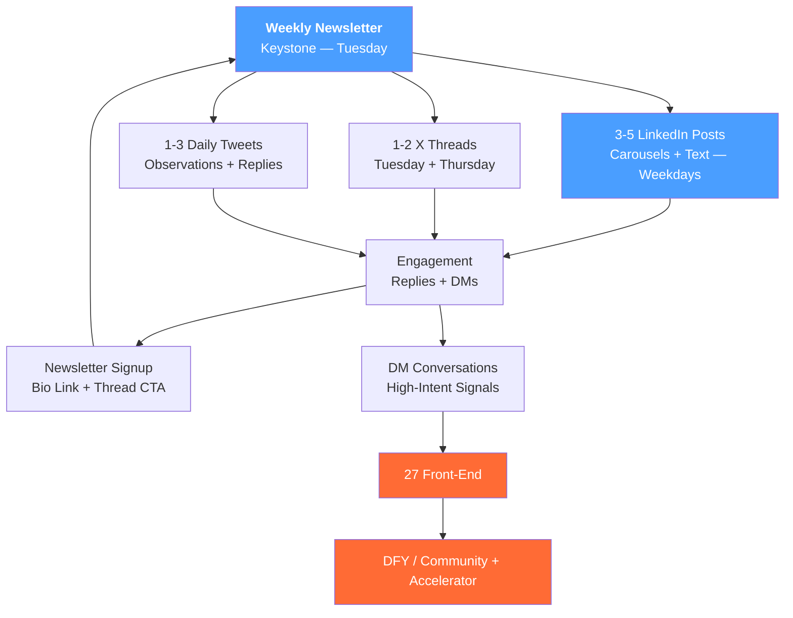

# Content Strategy

Newsletter-first content system for Client Ready.

---

## The Model

```
Weekly Newsletter (keystone)
    ↓
Deconstruct → 3-5 LinkedIn posts (carousels + text) + 1-2 X threads
    ↓
Daily → 1-3 tweets (observations, one-liners, replies)
    ↓
High-intent signals → DM conversations
    ↓
$27 → DFY / Community → Accelerator
```




**Philosophy:** Write once, repurpose everywhere. Email is the revenue engine; social is discovery.

---

## Platforms

| Platform | Role | Frequency | Format | Avg Engagement |
|----------|------|-----------|--------|----------------|
| **Beehiiv** | Engine | 1x/week (Tuesday) | Long-form newsletter | 40%+ open rate |
| **LinkedIn** | Primary discovery | 3-5 posts/week (cap at 5) | Carousels, text, video | 5.2% avg, 6.6% carousels |
| **X/Twitter** | Secondary discovery | 1-3 tweets/day + 1-2 threads/week | Text, threads | 2-5% (<5K), 1-3% (5K-100K) |

**Why LinkedIn first:** LinkedIn engagement (5.2%) is 5-10x higher than X (0.5-1% for medium accounts). Carousels at 6.6% are the highest-performing organic format across either platform. Diminishing returns hit after 5 posts/week on LinkedIn — quality over quantity.

**Not using:** Instagram, TikTok, YouTube (for now)

---

## Weekly Rhythm

| Day | Newsletter | LinkedIn (primary) | X/Twitter (secondary) |
|-----|------------|-----------|----------|
| **Monday** | Write newsletter | Carousel (pillar content) | 1-3 tweets |
| **Tuesday** | Send newsletter | Post adapted from newsletter | Thread from newsletter + tweets |
| **Wednesday** | — | Post (behind the scenes) | 1-3 tweets |
| **Thursday** | — | Carousel or text (alignment / build right) | Thread (standalone) + tweets |
| **Friday** | — | Post (engagement / question) | 1-3 tweets |
| **Weekend** | Batch next week | Light engagement | Light engagement |

**LinkedIn format mix:** 2 carousels + 2-3 text posts per week. Carousels drive reach (6.6%), text posts drive conversion (higher reply rate). Don't exceed 5 posts/week — diminishing returns.

**Time investment:** ~2-3 hrs/week (Phase 0 — batch-draft with Claude, manual posting)

---

## Content Pillars

| Pillar | What It Covers | Example Topics |
|--------|----------------|----------------|
| **Offer Creation** | Validation, pricing, positioning | "How to validate before you build", "The $27 test", "Why your offer isn't selling" |
| **Funnel Strategy** | Value ladders, bumps, OTOs, email | "Why most coaches build backwards", "The bump nobody talks about", "Email > content" |
| **Alignment** | Building right, offer-life fit, the diagnostic | "You can't grow into pain", "If the overlaps don't make sense, wrong offer", "Build something you won't burn down" |
| **Behind the Scenes** | Real numbers, real struggles | "114 sales: what I learned", "What actually happened this week", "The mistake I made" |

**Rotation:** Hit each pillar at least once per week across platforms.

---

## Hooks Library

### Contrarian Hooks
- "Most coaches have it backwards."
- "You don't need a bigger audience. You need a better offer."
- "Stop posting. Start selling."
- "The content treadmill is a trap."
- "Engagement doesn't pay rent."

### Direct Address Hooks
- "If you're still posting free content hoping someone buys..."
- "You've been told to 'add value first.' Wrong."
- "Here's what nobody tells you about high-ticket..."
- "The reason you're stuck isn't what you think."

### Transformation Hooks
- "From 0 to 114 sales in 30 days. Here's the system."
- "I validated a $5K offer in one afternoon. Here's how."
- "What changed when I stopped chasing followers."
- "The $27 offer that funds my entire business."

### Alignment Hooks
- "You can't grow into pain. Build something that fits."
- "Most coaches build the offer they think they should. Not the one that fits who they are."
- "If the overlaps between your interests and your offer don't make sense — wrong offer."
- "I'm not going to tell you to quit your 9-to-5. I'm going to help you build something worth quitting for."
- "The offer you'll burn down at $8K isn't better than the one you'll show up for at $3K."
- "Stop building someone else's playbook. Engineer your own."
- "AI is an amplifier. Feed it chaos, get polished chaos back."
- "Everyone's chasing the perfect prompt. The answer is a system, not a sentence."
- "Prompts without a system are ingredients without a kitchen."

### Thread Starters
- "I spent [X] learning [Y]. Here's what actually works:"
- "The exact system I use to [outcome]:"
- "Everyone's overcomplicating [topic]. Here's the simple version:"
- "[Number] things I'd do differently if I started over:"

---

## Thread Frameworks

### Problem → Solution (5-7 tweets)
1. Hook: State the problem boldly
2. Agitate: Why it's worse than they think
3. Bridge: What they've tried that doesn't work
4. Solution: Your framework (3-4 steps)
5. Proof: Your result or client result
6. CTA: Soft pitch or engagement ask

### "Here's the System" (7-10 tweets)
1. Hook: Promise the system
2. Context: Why you built it
3. Step 1-5: The actual steps
4. Result: What happens when you follow it
5. CTA: Where to get more

### Contrarian Take (5 tweets)
1. Hook: Bold contrarian statement
2. Why most people believe the opposite
3. What you've seen instead
4. The reframe
5. CTA: Agree/disagree engagement

---

## Conversion Path

### From Content to Cash

```
Content (value)
    ↓
Engagement (replies, DMs)
    ↓
Newsletter signup (bio link, thread CTA)
    ↓
Daily emails (trust + offers)
    ↓
$27 front-end
    ↓
Bumps + OTOs (DFY Offer Build, Newsletter, Community)
    ↓
Email ascension
    ↓
$5K Accelerator
```

### CTAs by Platform

| Platform | Primary CTA | Secondary CTA |
|----------|-------------|---------------|
| LinkedIn | Link to $27 offer / Newsletter signup | "DM me [word] for [thing]" |
| X/Twitter | "Follow for more" / Newsletter link in bio | "DM me if this resonates" |
| Newsletter | Relevant offer from value ladder | Reply to build relationship |

---

## DM Strategy

**Triggers to DM:**
- Engaged with 3+ posts
- Replied with a question
- Shared their struggle
- Fits ideal client profile

**DM Framework:**
1. Acknowledge their comment/situation
2. Ask one clarifying question
3. Listen
4. Offer relevant resource (free or $27)

**Not:** Pitch slapping. Relationship first.

---

## Metrics to Track

### Growth Metrics

| Metric | Where | Baseline | 30-Day | 90-Day |
|--------|-------|----------|--------|--------|
| Newsletter subscribers | Beehiiv | — | +200 | +1,000 |
| LinkedIn followers | LinkedIn | — | +200 | +1,000 |
| X followers | X | — | +300 | +1,500 |
| Newsletter open rate | Beehiiv | — | 40%+ | 40%+ |
| Welcome sequence open rate | Beehiiv | — | 70%+ | 80%+ |
| Organic → $27 sales/week | Funnel tracking | 0 | 2 | 10 |
| Newsletter-to-buyer conversion | Funnel tracking | — | Track | 2.6% target |
| Newsletter-to-buyer timeline | Funnel tracking | — | Track | 14-21 days |

### Engagement Benchmarks (2026)

| Metric | Benchmark | Source |
|--------|-----------|--------|
| LinkedIn post engagement | 5.2% avg | SocialInsider 2026 |
| LinkedIn carousel engagement | 6.6% | SocialInsider 2026 |
| LinkedIn video engagement | 5.6% | SocialInsider 2026 |
| LinkedIn text-only engagement | 3.2% | SocialInsider 2026 |
| X engagement (<5K followers) | 2-5% | Industry benchmarks |
| X engagement (5K-100K) | 1-3% | Industry benchmarks |
| X engagement (>100K) | 0.3-1% | Industry benchmarks |
| Organic subscriber conversion | 2.6% | vs 1.5% for paid |

### DM Conversion Funnel

| Stage | Benchmark |
|-------|-----------|
| Engagement → DM | 8-12% |
| DM → Conversation | 35-45% |
| Conversation → Sale | 15-25% |
| DM conversations/week | 5 (30-day) → 15 (90-day) |

### Diminishing Returns Thresholds

| Platform | Optimal Frequency | After This, Returns Drop |
|----------|-------------------|--------------------------|
| LinkedIn | 3-5 posts/week | >5 posts/week |
| X | 1-3 tweets/day | Marginal at any volume for medium accounts |
| Newsletter | 1x/week | 2x/week (unless segmented) |

**Review cadence:** Weekly (Sunday)

---

## Content Bank

_Add winning posts, high-engagement hooks, and proven frameworks here as you discover them._

### Top Performers (X)
| Date | Post | Engagement | Why It Worked |
|------|------|------------|---------------|
| — | — | — | — |

### Top Performers (LinkedIn)
| Date | Post | Engagement | Why It Worked |
|------|------|------------|---------------|
| — | — | — | — |

### Newsletter Issues (Best)
| Date | Subject | Open Rate | Click Rate | Why It Worked |
|------|---------|-----------|------------|---------------|
| — | — | — | — | — |

---

## Framework Library

_Add frameworks extracted from mining and research here._

### From Research (2026-02-03)

**Justin Welsh's "Hub and Spoke":**
- Newsletter = hub (80% effort)
- Social posts = spokes (20% effort)
- One piece of content → full week of posts

**Dickie Bush's Testing Method:**
- Test 8-10 single tweets per week
- Expand top 2 performers into threads
- Let engagement data guide effort

**LinkedIn Carousel Formula:**
- 6-10 slides (sweet spot)
- Hook on slide 1
- One idea per slide
- CTA on last slide

---

## Automation Pipeline

Git-tracked content production. All content lives in `content/` with full audit trail.

```
content/
├── drafts/       → Agent or human creates content here
├── scheduled/    → Approved content waiting to publish
└── published/    → Posted content with engagement metadata
```

### Phases

| Phase | What | Time/Week | Cost/Mo | Status |
|-------|------|-----------|---------|--------|
| **0: Manual** | Batch-draft with Claude, manual posting | 2-3 hrs | $0 | **Active** |
| **1: Scheduled** | Typefully + Buffer APIs, agent drafts, human reviews | <1 hr | ~$30 | March 2026 |
| **2: OpenClaw** | Always-on agent, Telegram approvals, auto-publish | 15 min/day | ~$87 | Q2 2026 |
| **3: Voice-Note** | Talk → transcribe → agent shapes → posts | 15 min/day | TBD | Q3 2026 |

**Phase gates:** Each phase requires 4+ weeks of proven performance before graduating.

### Phase 0 Workflow (Current)

1. Monday: Batch-draft a week of content using `/organic` or Claude Code
2. Save to `content/drafts/` — each piece gets frontmatter (platform, type, angle, pillar)
3. Review and edit
4. Post manually via Typefully (X) and LinkedIn native
5. Move to `content/published/` with engagement data after posting
6. Sunday: Review metrics, update Content Bank tables

**Trigger to enter Phase 1:** Consistent 4+ weeks of content shipping with measurable engagement data.

### Key Principle

> "OpenClaw READS from your business repo. Business truth stays in the business repo."

Reference files are the canon. Content is derivative. The automation layer never touches the source of truth — it only reads from `reference/` and writes to `content/`.

---

## Tools

| Purpose | Tool | Phase |
|---------|------|-------|
| Newsletter | Beehiiv | 0+ |
| Scheduling (X) | Typefully (manual → API) | 0 (manual), 1+ (API) |
| Scheduling (LinkedIn) | Native or Buffer | 0 (native), 1+ (Buffer) |
| Analytics | Platform native + spreadsheet | 0-1 |
| Content calendar | Git (`content/drafts/` directory) | 0+ |
| Automation | OpenClaw + DigitalOcean | 2+ |
| Transcription | whisper-cpp (local) | 3 |

---

## Next Actions

- [x] Set up Beehiiv account
- [x] Optimize X bio with newsletter link
- [x] Optimize LinkedIn headline and about section
- [x] Write first newsletter
- [x] Create first week of content
- [x] Set up `content/` pipeline directories (drafts, scheduled, published)
- [ ] Set up weekly metrics tracking
- [ ] Ship 4 consecutive weeks of content (Phase 0 → Phase 1 gate)
- [ ] Set up Typefully API connection (Phase 1 prerequisite)
- [ ] Set up Buffer for LinkedIn scheduling (Phase 1 prerequisite)

---

*Last updated: 2026-03-09*
*Decisions: [2026-02-03-content-strategy.md](../../decisions/2026-02-03-content-strategy.md), [2026-02-24-content-automation-rollout.md](../../decisions/2026-02-24-content-automation-rollout.md)*

---

## See Also

- [soul.md](../core/soul.md) — WHY behind the content
- [audience.md](../core/audience.md) — WHO we are creating for
- [voice.md](../core/voice.md) — HOW we write and speak
- [offer.md](../core/offer.md) — The value ladder content promotes
- [content-ideas.md](content-ideas.md) — Ideas library mapped to pillars and data
- [main-angles.md](../proof/angles/main-angles.md) — Angles that map to content pillars
- [testimonials.md](../proof/testimonials.md) — Proof points to weave into content
